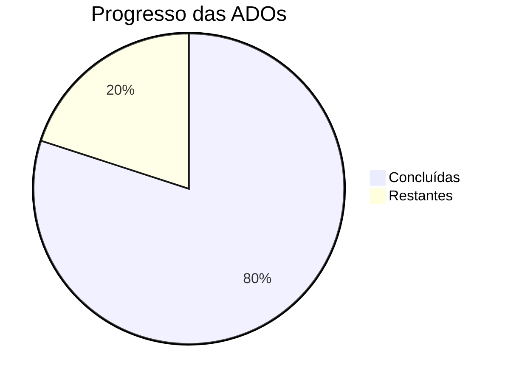

# 📚 Exercícios Faculdade

Repositório dedicado ao armazenamento dos **exercícios e atividades acadêmicas** desenvolvidos durante minha graduação.

Aqui estão organizadas as atividades propostas pelos professores ao longo do semestre, permitindo acompanhar minha evolução no aprendizado de **programação, lógica e desenvolvimento de software**.

---

# 📑 Sumário

- [🏫 Sobre a Faculdade](#-sobre-a-faculdade)
- [📖 Disciplinas](#-disciplinas)
  - [💡 Projeto Integrador](#-projeto-integrador)
  - [💻 Lógica e Algoritmos](#-lógica-e-algoritmos)
- [📂 Estrutura do Repositório](#-estrutura-do-repositório)
- [🧠 Conteúdo das ADOs](#-conteúdo-das-ados)
- [👨‍💻 Forma de Desenvolvimento](#-forma-de-desenvolvimento)
- [🚀 Objetivo do Repositório](#-objetivo-do-repositório)
- [📌 Observações](#-observações)

---

# 🏫 Sobre a Faculdade

Os exercícios presentes neste repositório são desenvolvidos durante minha formação acadêmica no:

🎓 **Senac - Campus Santo Amaro**

Durante o curso são propostas diversas atividades práticas com o objetivo de reforçar o aprendizado teórico e desenvolver habilidades essenciais na área de tecnologia e programação.

---

# 📖 Disciplinas

Atualmente os exercícios estão relacionados principalmente a duas matérias do curso.

## 💡 Projeto Integrador

Disciplina focada no **desenvolvimento de um projeto completo ao longo do semestre**.

O objetivo é aplicar na prática os conhecimentos adquiridos nas demais disciplinas, trabalhando aspectos como:

- Planejamento
- Organização
- Desenvolvimento de soluções
- Trabalho com projetos reais

---

## 💻 Lógica e Algoritmos

Disciplina responsável por introduzir os **fundamentos da programação**, utilizando a linguagem **Java** como base para o aprendizado.

Entre os principais conteúdos estudados estão:

- Lógica de programação
- Estrutura de algoritmos
- Operadores
- Tipos de dados
- Estruturas condicionais
- Resolução de problemas computacionais

---

# 📂 Estrutura do Repositório

O repositório está organizado em **pastas contendo as ADOs**.

### 📌 O que são ADOs?

**ADO** significa **Atividade de Desenvolvimento Orientado**.

São exercícios ou atividades propostas pelos professores para praticar os conteúdos aprendidos durante as aulas.

Cada ADO possui um **número que representa o avanço dentro do semestre**.

| ADO | Nível aproximado |
|----|----|
| ADO1 | Início do semestre |
| ADO2 | Conceitos iniciais |
| ADO3 | Desenvolvimento intermediário |
| ADO4 | Conteúdos mais estruturados |
| ADO5+ | Conteúdos mais avançados |

⚠️ **Importante**

Cada disciplina possui **ritmos diferentes de desenvolvimento**, portanto uma ADO de uma matéria pode estar **mais avançada ou mais básica** em relação à ADO de outra matéria.

---

# 📊 Progresso das ADOs

Abaixo está um gráfico representando o progresso atual das atividades desenvolvidas durante o semestre.

---

# 🧠 Conteúdo das ADOs

Até o momento, as atividades abordam os seguintes conteúdos:

## 📘 ADO1 — Introdução à Lógica de Programação

Primeiro contato com conceitos fundamentais da programação utilizando **Java**.

Principais tópicos:

- Introdução à lógica de programação
- Estrutura básica de um programa
- Primeiros conceitos da linguagem Java
- Entendimento do funcionamento de algoritmos

---

## 🔢 ADO2 — Operações Aritméticas

Aprendizado sobre **operações matemáticas dentro da programação**.

Principais tópicos:

- Operadores aritméticos
- Cálculos matemáticos
- Manipulação de valores numéricos
- Resolução de problemas simples com cálculos

---

## ⚙️ ADO3 — Operadores e Valores

Introdução a diferentes tipos de operações e valores dentro da linguagem.

Principais tópicos:

- Operadores em geral
- Comparações
- Valores booleanos (`true` / `false`)
- Expressões lógicas

---

## 🔀 ADO4 — Estruturas Condicionais

Introdução ao controle de fluxo de execução no programa.

Principais tópicos:

- Estrutura `if`
- Estrutura `else`
- Tomada de decisões no código
- Controle lógico do programa

---

# 👨‍💻 Forma de Desenvolvimento

Todos os exercícios deste repositório são realizados **individualmente**, com o objetivo de desenvolver:

- Autonomia na resolução de problemas
- Raciocínio lógico
- Pensamento computacional
- Boas práticas de programação

---

# 🚀 Objetivo do Repositório

Este repositório tem como objetivo:

- 📚 Organizar os exercícios realizados durante a faculdade
- 📈 Registrar a evolução no aprendizado de programação
- 🧠 Servir como material de consulta para estudos futuros
- 💻 Documentar práticas e experiências acadêmicas

---

# 📌 Observações

Este repositório continuará sendo atualizado conforme novas **ADOs e conteúdos** forem sendo desenvolvidos durante o curso.

---

⭐ Caso queira acompanhar minha evolução ou estudar alguns dos exercícios, fique à vontade para explorar o repositório.